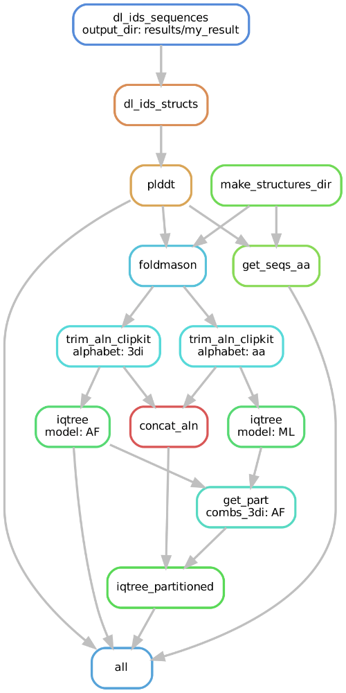

# A pipeline for single gene structural phylogenies
[](https://snakemake.github.io)

This repo impelements multiple phylogenetic methods based on protein structures. 

# Installation
Clone the repo

```
git clone https://github.com/jonasmehl1/structural_phylogenetics.git
```

Creeate the conda environment that contains all necessary dependencies

```
conda env create --file=workflow/envs/structural_phylogeny.yaml
```

# Data preparation

All that is needed is a file with uniprot identifiers called identifiers.txt (example in data/input/identifiers.txt).
A common workflow would be to identify homologs of a query sequence on the AlphaFoldDB with Foldseek and then download the resulting table.
This table can then be converted to the right format by using

```
python processing/AFDB_to_uniprot.py table.csv
```

Structures and sequences as well as metadata will then be downloaded automatically when running the snakemake pipeline. Parameters like the amount of UF boostraps or custom model selection can be adjusted in the config/params.yaml file. Custom structures are also possible, in that case create a output folder in results/ and create a folder called 'structs' that only contains the pdb structures.

# Usage

The normal way to run this pipeline would be to specify the name of the output directory to be created in /results and the name of the identifiers file found in data/input
```
snakemake --configfile config/params.yaml --config outdir=test identifiers=identifiers.txt -p -k -c 16
```

Since the pipeline can take some time it can also be launched in a non interactive session to prevent termial timeout

```
nohup snakemake --configfile config/params.yaml --config outdir=test identifiers=identifiers_test.txt -p -k -c 16 > .snakemake/log/snakemake_$(date +“%Y-%m-%d_%H-%M-%S”).log 2>&1 &
```

# Phylogeny pipeline

Structures are aligned using FoldMason and then trimmed using ClipKit. The pipeline will by default run a standard iqtree ML run on the amino acid alignment, as well as a ML run on the 3di alignment using the AF substitution matrix by [Garg & Hochberg, 2024](https://www.biorxiv.org/content/10.1101/2024.09.19.613819v3). Alternatively the 3di matrix by [Puente-Lelievre et al., 2024](https://www.biorxiv.org/content/10.1101/2023.12.12.571181v2) can also be used. Both alignments will then be concatenated to run a partition scheme. If desired (needs to be enabled in the main snakefile), additionally another tree will be computed with FastME using the more conventional Intramolecular distance metric, which is implemented in T-COFFEE. This includes a bootstrapping procedure where 100 trees are created from 100 bootstrapped matrices and combined. 



Below are the default parameters for tree reconstruction, which can be customized in config/params.yaml

* **Alignment**:
  	* **3Di**: foldmason easy-msa {input_structures} {output_alignment} /tmp --report-mode 1
	* **aa**: samee as for 3di as foldmason outputs both. Alternatively can also use mafft
	* **comb**: concatenate **aa** and **3Di**
 	
-- report-mode 1 will also create a html report that can be used to interactively visualize the structure alignment. Caution: this might take some time and resources to load if the alignment is large

* **Trimming**:
  	* **clipkit(default)**: clipkit {alignment} -o {output} -m gappy -l. This is the more conservative option
  	*  **trimal** trimal -in {alignment} -out {output} -automated1. More aggressive trimming approach that is used for the FastME trees.

* **Tree inference**:
	* **AA**: iqtree2 -s {aa.alignment} --prefix $tree_prefix -B 1000 -T {threads} --boot-trees --quiet --mem 16G --cmin 4 --cmax 12 –m MFP. Uses Modelfinder to find the best fit model
  	* **AF**: iqtree2 -s {3di.alignment}{same as AA} –mset resources/subst_matrixes/Q_mat_AF_Garg.txt
	* **FM**: fastme -i {distmat} -o {output} -g 1.0 -s -n -z 5
	* **3Di**: iqtree2 -s {3di.alignment} {same as AF} –mset 3DI -mdef resources/subst_matrixes/3DI.nexus
	* **Part**: Create partition file with best model from **ML** and **AF**. Then
		iqtree2 -s {combined_alignment} -p {input.part} -B 1000 -T {threads}

# Customization

In principle the entire pipeline is easily customizable by changing the input/output files in the snakemake rules, e.g. if we dont want to trim the alignments. So in the main snakefile workflow/snakefile simply comment out the parts with iqtree if you only want the structure alignments and snakemake will only execute until there.
