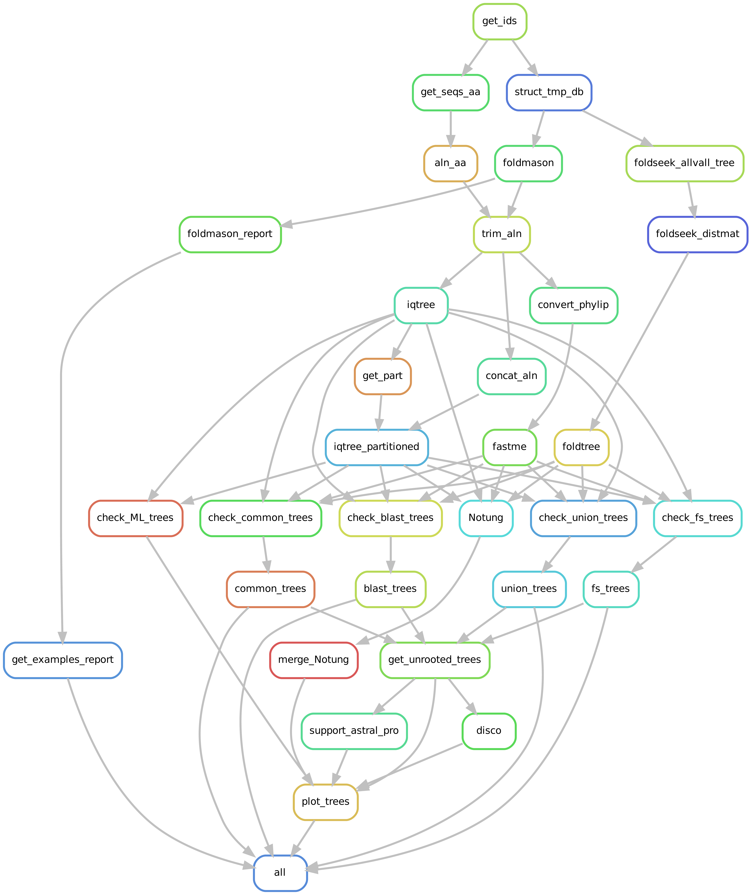

# A pipeline for single gene structural phylogenies
[](https://snakemake.github.io)

This repo helps impelements multiple phylogenetic methods based on protein structures. 

# Installation
Creeate the conda environment that contains all necessary dependencies

```
conda env create --file=workflow/envs/structural_phylogeny.yaml
```

# Data preparation

All that is needed is a file with uniprot identifiers called identifiers.txt (example in data/input/identifiers.txt)
A common workflow would be to identify homologs of a query sequence on the AlphaFoldDB with Foldseek and then download the resulting table.
This table can then be converted to the right format by using

```
processing/AFDB_to_uniprot.py table.csv
```

Structures and sequences as well as metadata will then be downloaded automatically when running the snakemake pipeline.


# Usage

The normal way to run this pipeline would be to specify the name of the output directory to be created in /results and the name of the identifiers file found in data/input
```
snakemake --configfile config/params.yaml --config outdir=test identifiers=identifiers_test.txt -p -k 
```

Since the pipeline can take some time it can also be launched in a non interactive session to prevent termial timeout

```
nohup snakemake --configfile config/params.yaml --config outdir=test identifiers=identifiers_test.txt -p > .snakemake/log/snakemake_$(date +“%Y-%m-%d_%H-%M-%S”).log 2>&1 ^C
```

# Phylogeny pipeline

Structures are aligned using FoldMason and then trimmed using ClipKit. The pipeline will by default run a standard iqtree ML run on the amino acid alignment, as well as a ML run on the 3di alignment using the substitution matrix by Garg & Hochberg. Both alignments will then be concatenated to run a partition scheme. Additionally another tree will be computed with FastME using the  more conventional the Intramolecular distance metric.



Below are the default parameters for tree reconstruction, which can be customized in config/params.yaml

* **Alignment**:
  	* **3Di**: foldmason easy-msa {input_structures} {output_alignment} /tmp --report-mode 1
	* **aa**: samee as for 3di as foldmason outputs both. Alternatively can also use mafft
	* **comb**: concatenate **aa** and **3Di**
 	
-- report-mode 1 will also create a html report that can be used to interactively visualize the structure alignment. Caution: this might take some time and resources to load if the alignment is large

* **Tree inference**:
	* **AA**: iqtree2 -s **aa.fa** --prefix $tree_prefix -B 1000 -T {threads} --boot-trees --quiet --mem 4G --cmin 4 --cmax 10 –mset LG
	* **FM**: fastme -q -p -T {threads} -b {params} -i **aa.phy** -o {output} > {log}
	* **3Di**: iqtree2 -s **3Di.fa** {same as LG} –mset 3DI -mdef resources/subst_matrixes/3DI.nexus
	* **GTR**: iqtree2 -s **3Di.fa** {same as LG} –mset GTR20
	* **AF**: iqtree2 -s **3Di.fa** {same as LG} –mset resources/subst_matrixes/Q_mat_AF_Garg.txt
	* **LLM**: iqtree2 -s **3Di.fa** {same as LG} –mset resources/subst_matrixes/Q_mat_LLM_Garg.txt
	* **Part**: Create partition file with best model from **LG** and **3Di**. Then
		iqtree2 -s **comb.fa** -p {input.part} --prefix $tree_prefix -mdef resources/subst_matrixes/3DI.nexus -B 1000 -T {threads}
	* **FT**: foldseek easy-search $structdir $structdir {output} $TMPDIR --format-output 'query,target,fident,lddt,alntmscore' --exhaustive-search -e inf; foldseekres2distmat_simple.py; quicktree

Since the drafting of the preprint two new models have been added **AF** and **LLM** from [Garg & Hochberg, 2024](https://www.biorxiv.org/content/10.1101/2024.09.19.613819v3). They work exactly as **3Di** but with new substiution matrixes (available in `resources/subst_matrixes/`).

To finally run the pipeline you can simply run this command and monitor that everything is more or less running fine.

```
snakemake --configfile config/example_phylome.yaml -p -j2 -k --sdm conda
```

The most important output files will be these two: 

* `results/{dataset}/trees/{seed}_unrooted_trees.txt`: has 5 columns (gene ID, target set, alphabet, model and tree text). This file is easily parsable in R or Python to do further analyses. You can find some R scripts to do that in `workflow/scripts/` 
* `results/{dataset}/trees/{seed}_mltrees.txt`: results of IQ-Tree model selection. 

# Contribute

This modular pipeline was born with the idea to be easily expandable as so many new structural phylogenetics tools are being released each month. Feel free to contribute or open an issue!
